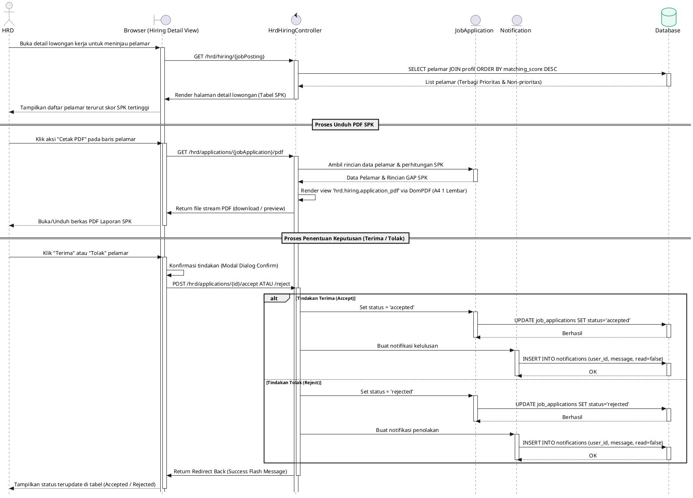
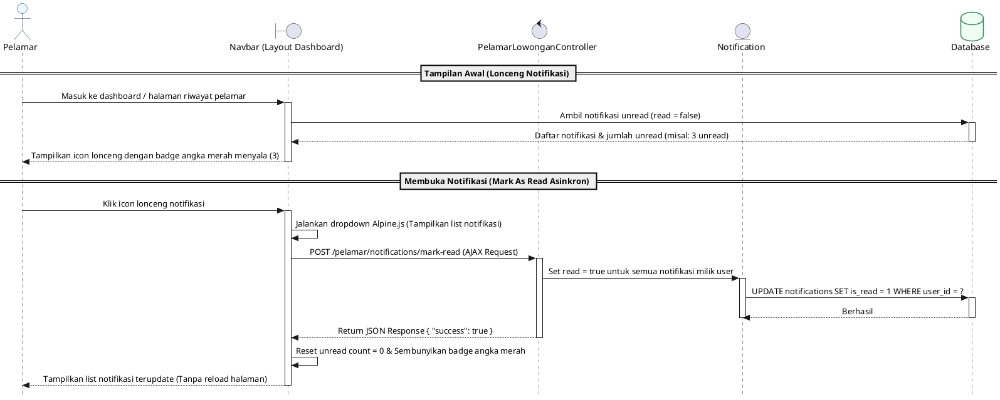

# 🎬 PlantUML Sequence Diagrams
## PT. Unggul Cipta Indah - Outsourcing & SPK Portal

Dokumen ini berisi kode **PlantUML** untuk **Sequence Diagram** lengkap yang menggambarkan alur interaksi antarkomponen dalam sistem. Diagram dibagi menjadi 5 alur utama:
1. **Pendaftaran Pelamar Baru (Registrasi dengan Verifikasi OTP)**
2. **HRD Membuat Lowongan Pekerjaan Baru dengan Konfigurasi Kriteria SPK**
3. **Pelamar Melamar Pekerjaan & Perhitungan SPK (Profile Matching) Otomatis**
4. **HRD Mengelola Pelamar, Mengunduh Laporan PDF, & Menentukan Keputusan (Terima/Tolak)**
5. **Pelamar Menerima Notifikasi Status secara Asinkron (AJAX)**

Anda dapat menyalin kode PlantUML di bawah ini ke editor online seperti [PlantText](https://www.planttext.com/) atau ekstensi PlantUML di VS Code untuk me-render gambar diagramnya.

---

## 1. Alur Registrasi Pelamar (dengan Verifikasi OTP)

Alur pendaftaran akun pelamar baru yang memerlukan verifikasi kode OTP sebelum akun diaktifkan.

@startuml
skinparam style strictuml
skinparam SequenceMessageAlignment center
skinparam ActorBorderColor #1A365D
skinparam ActorBackgroundColor #EBF8FF
skinparam ParticipantBorderColor #2B6CB0
skinparam ParticipantBackgroundColor #F7FAFC
skinparam DatabaseBorderColor #2F855A
skinparam DatabaseBackgroundColor #F0FFF4

actor "Pelamar" as pelamar
boundary "Browser (Register View)" as UI
control "AuthController" as authCtrl
entity "User" as userModel
database "Database" as DB

== Proses Submit Form Registrasi ==
pelamar -> UI : Isi Formulir Pendaftaran (Nama, Email, Password)
activate UI
UI -> authCtrl : POST /register (Request)
activate authCtrl

authCtrl -> userModel : Validasi data & Buat user baru (status pending/unverified)
activate userModel
userModel -> DB : INSERT INTO users (name, email, password, role='pelamar')
activate DB
DB --> userModel : User ID & Data tersimpan
deactivate DB
deactivate userModel

authCtrl -> authCtrl : Generate OTP Code & simpan di session/cache
authCtrl -> UI : Redirect ke /register/verify dengan flash message
deactivate authCtrl
UI --> pelamar : Tampilkan halaman verifikasi OTP
deactivate UI

== Proses Verifikasi OTP ==
pelamar -> UI : Input 6 digit kode OTP
activate UI
UI -> authCtrl : POST /register/verify (otp_code)
activate authCtrl

authCtrl -> authCtrl : Cek kesesuaian OTP di session/cache
alt OTP Valid
    authCtrl -> userModel : Update user status ke Verified
    activate userModel
    userModel -> DB : UPDATE users SET email_verified_at = NOW()
    activate DB
    DB --> userModel : Berhasil
    deactivate DB
    deactivate userModel
    authCtrl -> UI : Redirect ke /login dengan success message
    UI --> pelamar : Tampilkan halaman Login (Registrasi Sukses)
else OTP Tidak Valid / Kedaluwarsa
    authCtrl -> UI : Return back dengan error "OTP Salah/Expired"
    deactivate authCtrl
    UI --> pelamar : Tampilkan pesan error pada form OTP
    deactivate UI
end
@enduml
```

---

## 2. Alur Pembuatan Lowongan Kerja oleh HRD (Kriteria SPK)

Alur ketika HRD memposting lowongan kerja baru beserta pembobotan parameter SPK (Core Factor, Secondary Factor, Nonaktif).

@startuml
skinparam style strictuml
skinparam SequenceMessageAlignment center
skinparam ActorBorderColor #2C3E50
skinparam ActorBackgroundColor #ECF0F1
skinparam ParticipantBorderColor #2980B9
skinparam ParticipantBackgroundColor #FAFAFA
skinparam DatabaseBorderColor #27AE60
skinparam DatabaseBackgroundColor #E8F8F5

actor "HRD" as hrd
boundary "Browser (Create Job View)" as UI
control "HrdHiringController" as hiringCtrl
entity "JobPosting" as jobModel
database "Database" as DB

hrd -> UI : Akses Halaman Tambah Lowongan
activate UI
UI -> hiringCtrl : GET /hrd/hiring/create
activate hiringCtrl
hiringCtrl -> UI : Return view dengan daftar kategori & jenjang pendidikan
deactivate hiringCtrl
UI --> hrd : Tampilkan formulir pembuatan lowongan

== Input Detail & Kriteria SPK ==
hrd -> UI : Isi data lowongan & pilih pembobotan kriteria SPK\n(Core/Secondary/Nonaktif untuk Gender, Usia, SIM, dll.)
UI -> hiringCtrl : POST /hrd/hiring (Form Data)
activate hiringCtrl

hiringCtrl -> hiringCtrl : validatePosting(Request)\n(Validasi input gaji, lokasi, shift, dll.)
hiringCtrl -> hiringCtrl : Susun struktur requirements_config (Array JSON)
hiringCtrl -> jobModel : Instansiasi & simpan Lowongan baru
activate jobModel

jobModel -> DB : INSERT INTO job_postings (title, category, requirements_config, ...)
activate DB
DB --> jobModel : JobPosting ID
deactivate DB
deactivate jobModel

hiringCtrl -> UI : Redirect /hrd/hiring dengan success flash message
deactivate hiringCtrl
UI --> hrd : Tampilkan lowongan baru di list dashboard HRD
deactivate UI
@enduml
```

---

## 3. Alur Lamaran & Perhitungan SPK (Profile Matching)

Alur ketika pelamar mengirim lamaran, sistem langsung mencocokkan profil pelamar dengan konfigurasi lowongan melalui perhitungan matematis GAP.

@startuml Lamaran_SPK
skinparam style strictuml
skinparam SequenceMessageAlignment center
skinparam ActorBorderColor #1A365D
skinparam ActorBackgroundColor #EBF8FF
skinparam ParticipantBorderColor #2B6CB0
skinparam ParticipantBackgroundColor #F7FAFC
skinparam DatabaseBorderColor #2F855A
skinparam DatabaseBackgroundColor #F0FFF4

actor "Pelamar" as pelamar
boundary "Browser (Apply Job View)" as UI
control "PelamarLowonganController" as pelamarCtrl
entity "JobPosting" as jobModel
entity "JobApplication" as appModel
database "Database" as DB

pelamar -> UI : Klik "Lamar Sekarang" pada Lowongan Kerja
activate UI
UI -> pelamarCtrl : GET /pelamar/lowongan/{id}/apply
activate pelamarCtrl

pelamarCtrl -> appModel : Cek apakah sudah pernah melamar lowongan ini
activate appModel
appModel -> DB : SELECT status FROM job_applications WHERE ...
activate DB
DB --> appModel : Status (misal: pending/accepted/rejected)
deactivate DB

alt Lamaran Telah Diproses (Accepted / Rejected)
    appModel --> pelamarCtrl : Status: Accepted/Rejected
    pelamarCtrl -> UI : Redirect back dengan error "Lamaran sudah diproses"
    UI --> pelamar : Tampilkan notifikasi larangan update berkas
else Belum pernah melamar / Status Pending
    appModel --> pelamarCtrl : Status: None / Pending
    deactivate appModel
    pelamarCtrl -> UI : Tampilkan form lamaran kerja (Upload berkas & isian profil)
end
deactivate pelamarCtrl
deactivate UI

== Submit Berkas Lamaran ==
pelamar -> UI : Isi form & unggah berkas (CV, SIM C, SIM B1, dll) lalu submit
activate UI
UI -> pelamarCtrl : POST /pelamar/lowongan/{id}/apply (Form Data & Files)
activate pelamarCtrl

pelamarCtrl -> DB : Simpan berkas fisik ke storage & simpan data pendaftaran
activate DB
DB --> pelamarCtrl : Berhasil simpan
deactivate DB

pelamarCtrl -> jobModel : Panggil fungsi calculateSpkScore($application)
activate jobModel

== Perhitungan Profile Matching (Dalam Model JobPosting) ==
jobModel -> jobModel : Ambil requirements_config JSON
jobModel -> jobModel : Hitung GAP tiap kriteria (Kandidat - Target)
jobModel -> jobModel : Konversi GAP ke Bobot Nilai (Skala Kusrini, 2007)
jobModel -> jobModel : Hitung NCF (Core rata-rata) & NSF (Secondary rata-rata)
jobModel -> jobModel : Hitung Nilai Akhir = (0.6 * NCF) + (0.4 * NSF)
jobModel -> jobModel : Hitung Matching Score (%)
jobModel -> jobModel : Tentukan is_priority (Must match all Core Factors)
jobModel --> pelamarCtrl : Return [is_priority, matching_score]
deactivate jobModel

pelamarCtrl -> appModel : Simpan data lamaran beserta hasil SPK
activate appModel
appModel -> DB : UPDATE/INSERT INTO job_applications\nSET is_priority, matching_score, status='pending'
activate DB
DB --> appModel : OK
deactivate DB
deactivate appModel

pelamarCtrl -> UI : Redirect ke riwayat lamaran dengan pesan sukses
deactivate pelamarCtrl
UI --> pelamar : Tampilkan riwayat dengan status "Pending" & Score SPK
deactivate UI
@enduml
```

---

## 4. Alur Evaluasi HRD, Cetak PDF, & Keputusan Seleksi

Alur ketika HRD meninjau hasil peringkat SPK pelamar, mengunduh lembar GAP PDF, lalu menyetujui atau menolak lamaran tersebut.



---

## 5. Alur Notifikasi Pelamar (Asinkron / AJAX)

Alur bagaimana sistem menampilkan notifikasi status lamaran terbaru di navbar pelamar dan mereset status dibaca secara asinkron tanpa reload halaman.



---

Dibuat untuk memperjelas alur interaksi kelas dan rute controller pada PT. Unggul Cipta Indah Outsourcing Portal. 🚀
